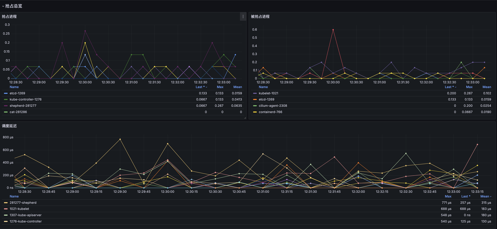

# Shepherd

Shepherd 是一个基于 Linux eBPF 技术的工具，专门用于检测和分析 Linux 系统中的进程调度延迟问题，特别关注"吵闹邻居"(noisy neighbor)导致的调度干扰。

## 主要特性

- 基于 eBPF tracepoints 实时监控进程调度行为
- 自动识别进程抢占事件，区分被抢占进程和抢占进程
- 支持 Prometheus 指标输出，便于监控集成
- 提供 Kubernetes 集成支持，可作为 DaemonSet 部署
- 支持 cgroup 级别的监控，适用于容器环境
- 内置流量控制机制，最小化性能开销

## 工作原理

Shepherd 通过以下机制实现调度延迟监控：

1. 使用 eBPF 程序监控关键调度事件：
   - sched_wakeup
   - sched_wakeup_new
   - sched_switch
   
2. 计算调度延迟：
   - 记录进程唤醒时间
   - 在进程实际被调度时计算延迟
   - 识别是否发生抢占

3. 数据采集优化：
   - 支持可配置的采样率
   - 内置延迟阈值过滤

## 快速开始

### 环境要求

- Linux 内核版本 >= 6.8
- 已启用 BTF (Binary Type Format)
- 已安装 LLVM 和 Clang
- Go 1.22 或更高版本

### 初始化 ClickHouse

```sql
CREATE DATABASE IF NOT EXISTS shepherd;
CREATE TABLE shepherd.sched_latency
(

    `pid` UInt32,

    `tid` UInt32,

    `delay_ns` UInt64,

    `ts` UInt64,

    `preempted_pid` UInt32,

    `preempted_comm` String,

    `is_preempt` UInt8,

    `comm` String,

    `date` Date DEFAULT today(),

    `datetime` DateTime64(9) DEFAULT now64(9)
)
ENGINE = MergeTree
ORDER BY (date,
 ts)
SETTINGS index_granularity = 8192;
``` 

### 导入 Grafana 模板
- 导入 `deploy/dashboard/on-cpu-sched-preempted.json`
- 配置 ClickHouse 和 Prometheus 数据源

Dashboard 包含以下面板:

1. 抢占总览
   - 抢占进程统计
   - 被抢占进程统计  
   - 调度延迟趋势



1. 抢占详情
   - 抢占拓扑图
   - 抢占明细表


## 数据说明

- `delay_ns`: 调度延迟时间(纳秒)
- `is_preempt`: 是否为抢占事件(1:是 0:否)
- `comm/preempted_comm`: 进程名称
- `pid/preempted_pid`: 进程 ID

### 安装

```bash
git clone https://github.com/cen-ngc5139/shepherd.git
cd shepherd
make build
```

### 配置

配置文件位于 `cmd/config.yaml`，主要配置项包括：

- BTF 配置
- 采样和阈值设置
- 监控目标设置
- 输出配置（Prometheus/日志）

### 启动

```bash
./shepherd --config-path=./cmd/config.yaml
```

### Kubernetes 部署

使用 Helm 部署到 Kubernetes 集群：

```bash
helm install shepherd deploy/helm
```

## 监控指标

Shepherd 提供以下核心指标：

- `sched_latencies`: 进程调度延迟统计
- `sched_preempted`: 进程被抢占次数
- `sched_preempte`: 进程抢占其他进程次数

## 调试功能

- 支持 pprof 性能分析
- 详细的内核验证器日志
- BTF 规范自动加载

## 贡献指南

欢迎提交 Pull Request 和 Issue。在提交代码前，请确保：

1. 代码通过所有测试
2. 遵循项目代码规范
3. 更新相关文档
4. 保持良好的代码注释

## 许可证

本项目采用双重许可：Apache-2.0 和 GPL-2.0

## 联系方式

如有问题或建议，请通过 GitHub Issues 与我们联系。

